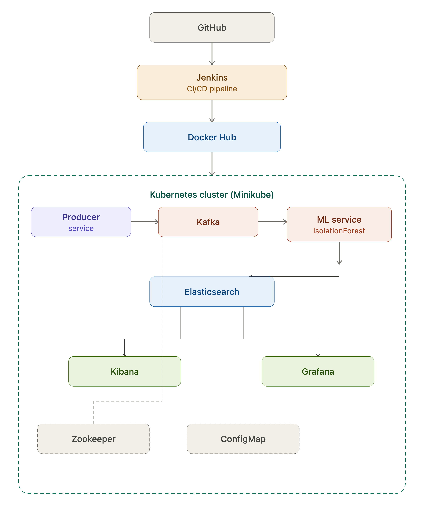
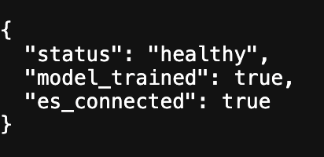
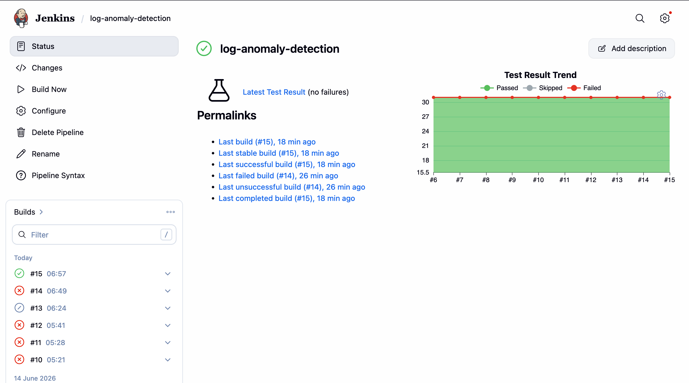
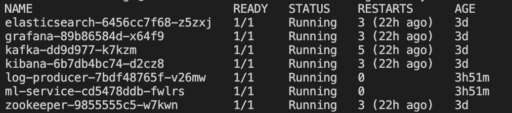
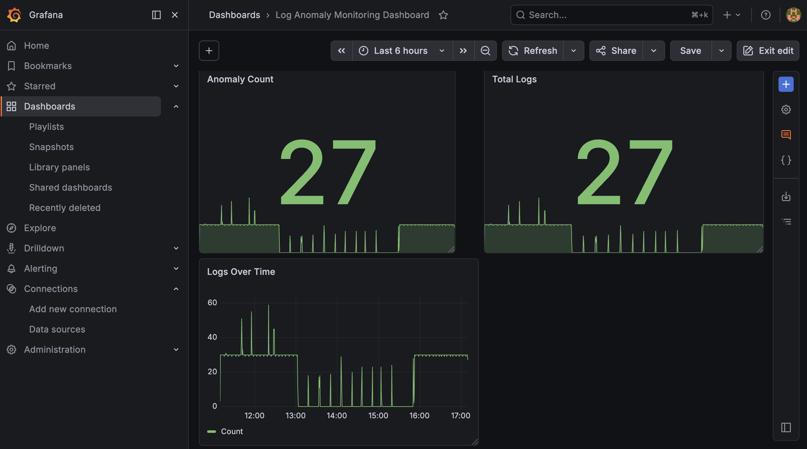
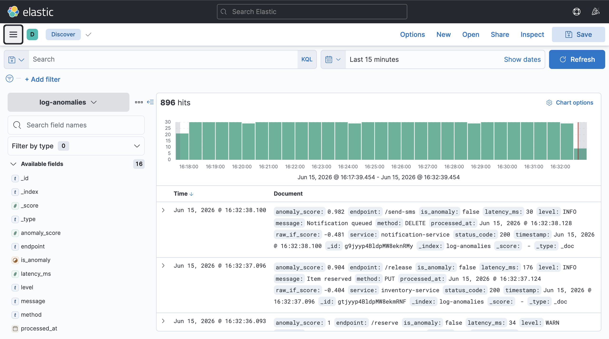

# 🔍 Real-Time Anomaly Detection Pipeline


> A production-style, end-to-end pipeline that ingests real-time data streams, detects anomalies using machine learning (Isolation Forest), and visualises results live — all deployed on Kubernetes.

---

## 📖 Project Story

### The Problem

Fraud, system failures, and security breaches often hide in plain sight — buried inside millions of normal-looking data points. Traditional rule-based systems fail because they can't adapt. You either get flooded with false positives or miss real threats entirely.

I wanted to build something closer to what production systems actually use: a pipeline that **continuously ingests streaming data, applies unsupervised ML in real-time, stores flagged anomalies, and makes them instantly visible** — without a human manually running queries.

### Why I Built This

My interest started with real-time fraud detection — the idea that a credit card transaction should be evaluated and flagged *before it completes*, not hours later in a batch job. That led me down the rabbit hole of event streaming (Kafka), containerised ML services, and cloud-native deployment (Kubernetes).

This project is my attempt to wire all of those together into something that actually works end-to-end — not just a notebook, but a deployable system.

### What I Learned

- How Kafka decouples producers from consumers at scale
- Why Isolation Forest is well-suited to unsupervised anomaly detection on high-dimensional streams
- How to containerise ML services and orchestrate them with Kubernetes
- How Elasticsearch + Kibana + Grafana create a full observability stack

---

## 🏗️ Architecture



```
GitHub → Jenkins CI/CD → Docker Hub → Kubernetes (Minikube)
                                              │
                    ┌─────────────────────────┤
                    │                         │
             Producer Service          Zookeeper + ConfigMap
                    │
                  Kafka
                    │
            ML Service (Isolation Forest)
                    │
             Elasticsearch
               /         \
           Kibana        Grafana
```

| Component | Role |
|---|---|
| **Producer Service** | Generates or ingests streaming data, publishes to Kafka |
| **Apache Kafka** | Message broker — decouples data ingestion from processing |
| **Zookeeper** | Manages Kafka cluster coordination |
| **ML Service** | Consumes from Kafka, runs Isolation Forest, flags anomalies |
| **Elasticsearch** | Stores raw + flagged data for querying |
| **Kibana** | Visual dashboards on top of Elasticsearch |
| **Grafana** | Metrics and alerting dashboards |
| **ConfigMap** | Kubernetes config for environment variables |
| **Jenkins** | CI/CD — builds Docker images, pushes to Docker Hub, deploys |

---

## 🧠 How the Anomaly Detection Works

The ML service uses **Isolation Forest** — an unsupervised algorithm that works by randomly partitioning the feature space. Anomalous data points are isolated in fewer splits than normal ones, giving them a lower anomaly score.

**Why Isolation Forest?**
- No labelled data required (unsupervised)
- Handles high-dimensional data well
- Computationally efficient for streaming use cases
- Low false positive rate compared to distance-based methods

Each message consumed from Kafka is scored in real-time. If the score falls below the contamination threshold, it is tagged as an anomaly and indexed into Elasticsearch with a flag.



---

## 📸 Screenshots

### CI/CD & Kubernetes Architecture


---

### Jenkins — Successful Pipeline Build

> Every push to `main` triggers a full Build → Test → Push → Deploy cycle. All stages green = new version live on Kubernetes.

---

### Kubernetes — All Pods Running

> All services (Kafka, Zookeeper, ML Service, Elasticsearch, Kibana, Grafana) deployed and healthy inside Minikube.

---

### Grafana — Live Metrics Dashboard

> Real-time metrics: messages processed per minute, anomaly rate over time, and pod health — all in one view.

---

### Kibana — Anomaly Events Discovery

> Elasticsearch documents indexed by the ML service, filterable by `is_anomaly: true`. Each flagged event visible with its anomaly score.

---

### ML Service — Health & Logs

> Live logs from the Isolation Forest consumer — showing messages consumed, scored, and anomalies flagged in real-time.

---

## 🚀 Quick Start

### Prerequisites

- [Docker](https://docs.docker.com/get-docker/)
- [Minikube](https://minikube.sigs.k8s.io/docs/start/)
- [kubectl](https://kubernetes.io/docs/tasks/tools/)
- [Helm](https://helm.sh/docs/intro/install/) (optional, for Kafka)

### One-Command Demo

```bash
chmod +x demo.sh && ./demo.sh
```

This script will:
1. Start Minikube
2. Deploy Kafka + Zookeeper
3. Deploy the ML service
4. Deploy Elasticsearch, Kibana, Grafana
5. Inject sample streaming data with anomalies baked in
6. Open Kibana and Grafana in your browser automatically

### Manual Setup

```bash
# 1. Start Minikube
minikube start --memory=4096 --cpus=2

# 2. Apply all Kubernetes manifests
kubectl apply -f k8s/

# 3. Wait for pods to be ready
kubectl wait --for=condition=ready pod --all --timeout=120s

# 4. Port-forward services
kubectl port-forward svc/kibana 5601:5601 &
kubectl port-forward svc/grafana 3000:3000 &

# 5. Start the producer
kubectl port-forward svc/producer 8080:8080 &
```

---

## 📁 Project Structure

```
├── producer/               # Data producer service
│   ├── main.py
│   └── Dockerfile
├── ml-service/             # Isolation Forest anomaly detector
│   ├── model.py
│   ├── consumer.py
│   └── Dockerfile
├── k8s/                    # Kubernetes manifests
│   ├── kafka-deployment.yaml
│   ├── zookeeper-deployment.yaml
│   ├── ml-service-deployment.yaml
│   ├── elasticsearch-deployment.yaml
│   ├── kibana-deployment.yaml
│   ├── grafana-deployment.yaml
│   └── configmap.yaml
├── jenkins/
│   └── Jenkinsfile
├── screenshots/
│   ├── cicd_kubernetes_architecture.png
│   ├── grafana-dashboard.png
│   ├── jenkins-success.png
│   ├── kibana-discover.png
│   ├── kubernetes-pods.png
│   └── ml-health.png
├── tests/
├── demo.sh
└── README.md
```

---

## 🔄 CI/CD Pipeline

Every push to `main` triggers the Jenkins pipeline:

1. **Build** — Docker images built for producer and ML service
2. **Test** — Unit tests run inside the container
3. **Push** — Images pushed to Docker Hub
4. **Deploy** — `kubectl apply` rolls out the new version to Minikube

---

## 📊 Sample Anomaly Event (Elasticsearch Document)

```json
{
  "timestamp": "2024-11-10T14:23:01Z",
  "value": 987.43,
  "feature_vector": [0.92, 0.14, 0.78, 0.03],
  "anomaly_score": -0.312,
  "is_anomaly": true,
  "source": "producer-service"
}
```

---

## 🛣️ Roadmap

- [ ] Add alerting via Grafana webhooks (Slack / email)
- [ ] Replace Isolation Forest with a streaming model (River ML)
- [ ] Deploy to a cloud Kubernetes cluster (GKE / EKS)
- [ ] Add authentication to Kibana and Grafana
- [ ] Benchmark throughput (messages/sec) under load

---

## 🤝 Contributing

Pull requests are welcome. For major changes, open an issue first to discuss what you'd like to change.

---

## 📄 License

MIT
